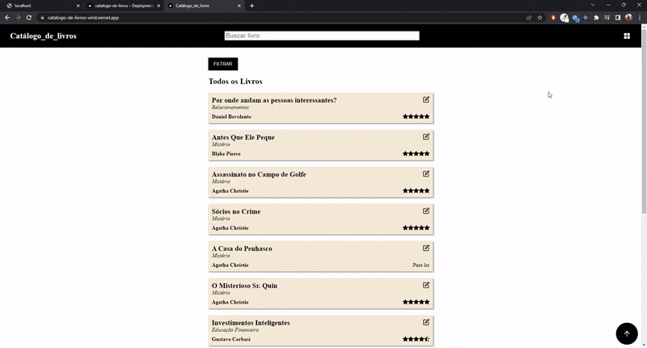
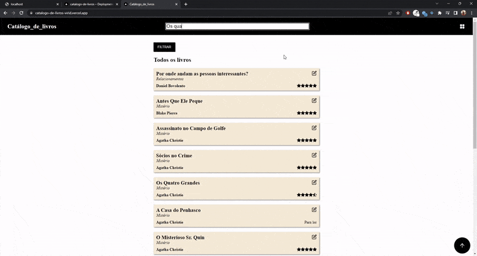
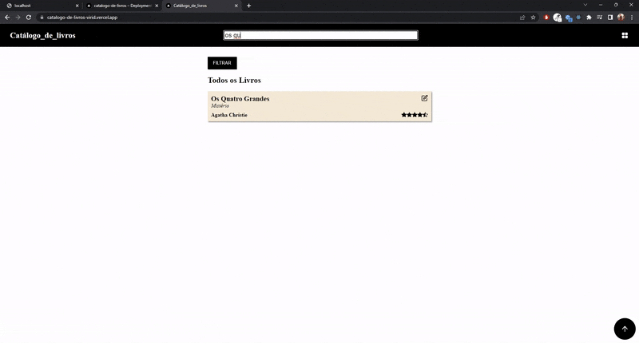

# Catálogo de Livros

### Um site que permite ao usuário catalogar livros, permitindo que ele adicione um título, gênero, autor e uma nota para o livro, ou definir o livro para ainda ser lido. Permite ainda que o usuário edite, delete e também pesquise pelos livros.

### Nesse projeto foi utilizado o Next para lidar com o roteamento das páginas e o React para os componentes. Foi utlizado como backend para armazenar as informações dos livros o banco de dados NoSQL Cloud Firestore do Firebase. Também foi utilizado o Dotenv para 'setar' as variáveis de ambiente do Firebase, a fim de não ficarem expostas aqui no GitHub.

### Foi feito o deploy desse projeto na Vercel e o site pode ser acessado e testado neste link: https://catalogo-de-livros-virid.vercel.app/

 

#### Adicionando um livro

 

#### Mostrando os filtros

 

#### Atualizando um livro
